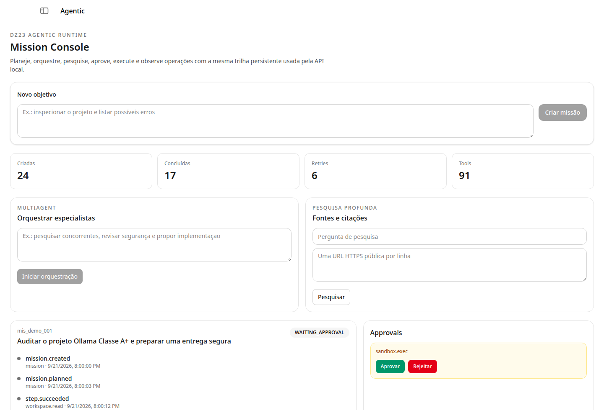

<p align="center">
  <a href="https://github.com/DZ23-LTDA/ollama-classe-a-plus">
    <strong>Ollama Classe A+</strong>
  </a>
</p>

# Ollama Classe A+

> **Uma distribuição agentic local-first para modelos, automações, pesquisa, builders e operação segura.**

Este repositório público reúne a base Ollama DZ23 e a evolução agentic do projeto. O manual completo, os contratos, a configuração e a política de atualização estão em [`docs/CLASS_A_PLUS_GUIDE.md`](docs/CLASS_A_PLUS_GUIDE.md).

### Visão rápida — estado visual observado em desenvolvimento



> **Proveniência:** esta é uma captura real da rota `/agentic`, publicada na `main` como documentação do estado visual observado durante o desenvolvimento. Ela usa dados demonstrativos locais e não representa um release instalável nem comprova credenciais, contas externas, dispositivos, deploy ou homologação. Consulte a [proveniência dos assets](docs/images/ASSET_PROVENANCE.md) antes de interpretar qualquer imagem em `docs/images/` como tela do produto.

Para conhecer o estado das telas planejadas de configuração, builder e mobile, veja a [galeria visual](docs/CLASS_A_PLUS_GUIDE.md#telas-e-estado-visual). Mockups conceituais são identificados como conceito e não são apresentados como funcionalidades concluídas.

| Recurso | Documento |
|---|---|
| Instalação, configuração, telas e contribuição | [`CLASS_A_PLUS_GUIDE.md`](docs/CLASS_A_PLUS_GUIDE.md) |
| Arquitetura do runtime | [`agentic/ARCHITECTURE.md`](docs/agentic/ARCHITECTURE.md) |
| API e endpoints | [`agentic/API.md`](docs/agentic/API.md) |
| Integrações, OAuth, SAML, MCP e deploy | [`agentic/INTEGRATIONS.md`](docs/agentic/INTEGRATIONS.md) |
| Roadmap e status por fase | [`agentic/ROADMAP.md`](docs/agentic/ROADMAP.md) |

## Compilar e executar este fork

O Ollama Classe A+ **não publica neste momento um instalador assinado, uma imagem Docker oficial ou um pacote binário versionado próprio**. Por isso, comandos como `ollama.com/install.sh`, downloads do domínio `ollama.com`, `ollama/ollama` no Docker Hub e pacotes `ollama` de SDK não instalam este fork. O caminho reproduzível abaixo compila o código deste repositório.

### Linux, macOS e Windows (build de desenvolvimento)

Requisitos: Git, Go na versão indicada em [`go.mod`](go.mod), Node.js/npm para a interface web e as ferramentas nativas exigidas pelo backend em cada sistema operacional.

```shell
git clone https://github.com/DZ23-LTDA/ollama-classe-a-plus.git
cd ollama-classe-a-plus

# A main é a linha pública de documentação; esta branch contém a evolução agentic em revisão.
git switch feat/manus-parity-omniroute

go build -o ./bin/ollama-classe-a-plus .
OLLAMA_HOST=127.0.0.1:11434 ./bin/ollama-classe-a-plus serve
```

Em outro terminal, para levantar a interface em modo de desenvolvimento:

```shell
cd ollama-classe-a-plus/app/ui/app
npm ci
npm run dev -- --host 127.0.0.1
```

O frontend de desenvolvimento consulta o servidor agentic local em `http://127.0.0.1:3001` conforme [`src/lib/config.ts`](app/ui/app/src/lib/config.ts); ajuste a configuração local caso o backend esteja em outra porta. O build acima valida o motor, mas não substitui empacotamento, assinatura, instalador, atualização ou rollback.

> **BLOCKED_BY_EXTERNAL_DEPENDENCY:** instaladores assinados, artefatos de release, auto-update, rollback verificável, imagens Docker publicadas e validação física em Linux/macOS/Windows ainda exigem pipeline de release, chaves, máquinas e homologação do mantenedor. Não existe neste README uma promessa desses artefatos.

### Bibliotecas e documentação upstream compatíveis

Os SDKs e a documentação do ecossistema Ollama podem ser usados quando o contrato compatível for suficiente, mas eles são dependências upstream e não distribuem o binário Classe A+:

- [ollama-python](https://github.com/ollama/ollama-python)
- [ollama-js](https://github.com/ollama/ollama-js)
- [documentação upstream de API](https://docs.ollama.com/api)

## Primeiros passos

Depois de iniciar o servidor compilado, a API local pode ser exercitada com o CLI do binário:

```shell
./bin/ollama-classe-a-plus --help
./bin/ollama-classe-a-plus agent --help
```

O runtime agentic expõe as rotas versionadas sob `/api/agent/v1`. Providers, conectores, MCP, OAuth, SSO, mídia, deploy e automações externas são opt-in, ficam sob responsabilidade do operador e não recebem credenciais deste repositório.

### Integrações de desenvolvimento

To launch a specific integration:

```shell
./bin/ollama-classe-a-plus launch claude
```

As integrações documentadas incluem [Claude Code](https://docs.ollama.com/integrations/claude-code), [Codex](https://docs.ollama.com/integrations/codex), [Copilot CLI](https://docs.ollama.com/integrations/copilot-cli), [DeepSeek Harness](https://docs.ollama.com/integrations/deepseek-harness), [Droid](https://docs.ollama.com/integrations/droid) e [OpenCode](https://docs.ollama.com/integrations/opencode). Essas páginas são referências de compatibilidade do ecossistema upstream; não significam que as contas, CLIs ou serviços externos estejam incluídos ou homologados neste fork.

### Assistentes e modelos

Use [OpenClaw](https://docs.ollama.com/integrations/openclaw) to turn Ollama into a personal AI assistant across WhatsApp, Telegram, Slack, Discord, and more:

```
./bin/ollama-classe-a-plus launch openclaw
```

### Conversar com um modelo local

Run and chat with [Gemma 4](https://ollama.com/library/gemma4):

```
./bin/ollama-classe-a-plus run gemma4
```

Consulte a [biblioteca upstream de modelos](https://ollama.com/library) somente para escolher um modelo compatível; o catálogo, os downloads e os termos desse serviço não são publicados nem operados pelo Classe A+. Veja o [guia do projeto](docs/CLASS_A_PLUS_GUIDE.md) para os limites locais e de segurança.

## REST API

Ollama has a REST API for running and managing models.

```
curl http://localhost:11434/api/chat -d '{
  "model": "gemma4",
  "messages": [{
    "role": "user",
    "content": "Why is the sky blue?"
  }],
  "stream": false
}'
```

Veja a [API do motor compatível](https://docs.ollama.com/api) para os endpoints herdados e a [API agentic do Classe A+](docs/agentic/API.md) para missões, approvals, artifacts e integrações.

### DZ23 multi-provider mode

This fork can expose explicitly configured API and CLI providers beside local models through the same Ollama and OpenAI-compatible endpoints. The feature is disabled by default. See [Ollama DZ23 multi-provider mode](docs/dz23-multi-provider.md) for configuration, security boundaries, and the built-in CLI/agent catalog.

### DZ23 agentic runtime

O fork inclui um runtime agentic com missões persistentes, planos validados, tools com approval, isolamento de workspace, manifests de artifacts, histórico de eventos, recovery, fila persistente com retries/dead-letter/replay, persistência PostgreSQL e workers Redis opcionais, SSE, traces locais e OTLP, orquestração multiagente, pesquisa com citações/cache/robots/SSRF guard, Browser Operator Playwright, pairing de companions, transporte TLS/mTLS, lifecycle MCP stdio, memória semântica, ingestão documental, connectors HTTP, schedules/webhooks, métricas, MFA/OIDC/SAML adapters, RBAC, colaboração, adapters multimodais, OCR local quando instalado, canvas visual, exportadores e builders locais. Os adapters de deploy para Vercel, Netlify e generic existem como contratos controlados, mas **deploy externo, credenciais, approval operacional, health check e rollback ainda exigem configuração e smoke autorizado do operador**. Configure `OLLAMA_AGENT_ROOT`, opcionalmente `OLLAMA_AGENT_STORE`, `OLLAMA_AGENT_DATABASE_URL`, `OLLAMA_AGENT_REDIS_URL`, `OLLAMA_AGENT_OTLP_ENDPOINT`, `OLLAMA_AGENT_MODEL`, `OLLAMA_AGENT_EMBED_MODEL`, `OLLAMA_AGENT_CONNECTORS`, `OLLAMA_AGENT_DEPLOYMENTS`, `OLLAMA_AGENT_MCP`, `OLLAMA_AGENT_AUTH_STORE`, `OLLAMA_AGENT_AUTH_REQUIRED`, `OLLAMA_AGENT_AUTH_SSO_PUBLIC`, `OLLAMA_AGENT_MEDIA_BASE_URL` e `OLLAMA_AGENT_MEDIA_API_KEY`, então use a API ou a CLI:

```shell
ollama agent create --objective "inspecionar o workspace" --auto-run
```

Read [the agentic architecture](docs/agentic/ARCHITECTURE.md), [the integrations guide](docs/agentic/INTEGRATIONS.md), [the executable roadmap](docs/agentic/ROADMAP.md), [the API guide](docs/agentic/API.md), the [phase 7 delivery note](docs/agentic/PHASE7_DELIVERY.md), the [phase 8 delivery note](docs/agentic/PHASE8_DELIVERY.md), and the [harness comparison synthesis](docs/agentic/HARNESS_COMPARISON_SYNTHESIS.md). The Web Agentic Console and an Expo mobile client are included as operator surfaces. Provider credentials, EAS signing, external OAuth/OIDC/SAML configuration, Tesseract installation and hosting credentials remain deployment responsibilities; the code does not execute an external publish without explicit approval.

### SDKs upstream compatíveis (não instalam o fork)

```
pip install ollama
```

```python
from ollama import chat

response = chat(model='gemma4', messages=[
  {
    'role': 'user',
    'content': 'Why is the sky blue?',
  },
])
print(response.message.content)
```

### JavaScript

```
npm i ollama
```

```javascript
import ollama from "ollama";

const response = await ollama.chat({
  model: "gemma4",
  messages: [{ role: "user", content: "Why is the sky blue?" }],
});
console.log(response.message.content);
```

## Supported backends

- [llama.cpp](https://github.com/ggml-org/llama.cpp) project founded by Georgi Gerganov.

## Documentação

- [Guia do Classe A+](docs/CLASS_A_PLUS_GUIDE.md)
- [Arquitetura agentic](docs/agentic/ARCHITECTURE.md)
- [API agentic](docs/agentic/API.md)
- [Integrações e limites](docs/agentic/INTEGRATIONS.md)
- [CLI de compatibilidade](https://docs.ollama.com/cli)
- [REST API de compatibilidade](https://docs.ollama.com/api)
- [Importação de modelos upstream](https://docs.ollama.com/import)
- [Modelfile upstream](https://docs.ollama.com/modelfile)
- [Build upstream de referência](https://github.com/ollama/ollama/blob/main/docs/development.md)

## Integrações comunitárias upstream

> A lista abaixo foi herdada como referência do ecossistema Ollama. Esses projetos não fazem parte do Classe A+, não são instalados por este repositório e não têm contas conectadas ou homologação implícita.

### Chat Interfaces

#### Web

- [Open WebUI](https://github.com/open-webui/open-webui) - Extensible, self-hosted AI interface
- [Onyx](https://github.com/onyx-dot-app/onyx) - Connected AI workspace
- [LibreChat](https://github.com/danny-avila/LibreChat) - Enhanced ChatGPT clone with multi-provider support
- [Lobe Chat](https://github.com/lobehub/lobe-chat) - Modern chat framework with plugin ecosystem ([docs](https://lobehub.com/docs/self-hosting/examples/ollama))
- [NextChat](https://github.com/ChatGPTNextWeb/ChatGPT-Next-Web) - Cross-platform ChatGPT UI ([docs](https://docs.nextchat.dev/models/ollama))
- [Perplexica](https://github.com/ItzCrazyKns/Perplexica) - AI-powered search engine, open-source Perplexity alternative
- [big-AGI](https://github.com/enricoros/big-AGI) - AI suite for professionals
- [Lollms WebUI](https://github.com/ParisNeo/lollms-webui) - Multi-model web interface
- [ChatOllama](https://github.com/sugarforever/chat-ollama) - Chatbot with knowledge bases
- [Bionic GPT](https://github.com/bionic-gpt/bionic-gpt) - On-premise AI platform
- [Chatbot UI](https://github.com/ivanfioravanti/chatbot-ollama) - ChatGPT-style web interface
- [Hollama](https://github.com/fmaclen/hollama) - Minimal web interface
- [Chatbox](https://github.com/Bin-Huang/Chatbox) - Desktop and web AI client
- [chat](https://github.com/swuecho/chat) - Chat web app for teams
- [Ollama RAG Chatbot](https://github.com/datvodinh/rag-chatbot.git) - Chat with multiple PDFs using RAG
- [Tkinter-based client](https://github.com/chyok/ollama-gui) - Python desktop client

#### Desktop

- [Dify.AI](https://github.com/langgenius/dify) - LLM app development platform
- [AnythingLLM](https://github.com/Mintplex-Labs/anything-llm) - All-in-one AI app for Mac, Windows, and Linux
- [Maid](https://github.com/Mobile-Artificial-Intelligence/maid) - Cross-platform mobile and desktop client
- [Witsy](https://github.com/nbonamy/witsy) - AI desktop app for Mac, Windows, and Linux
- [Cherry Studio](https://github.com/kangfenmao/cherry-studio) - Multi-provider desktop client
- [Ollama App](https://github.com/JHubi1/ollama-app) - Multi-platform client for desktop and mobile
- [PyGPT](https://github.com/szczyglis-dev/py-gpt) - AI desktop assistant for Linux, Windows, and Mac
- [Alpaca](https://github.com/Jeffser/Alpaca) - GTK4 client for Linux and macOS
- [SwiftChat](https://github.com/aws-samples/swift-chat) - Cross-platform including iOS, Android, and Apple Vision Pro
- [Enchanted](https://github.com/AugustDev/enchanted) - Native macOS and iOS client
- [RWKV-Runner](https://github.com/josStorer/RWKV-Runner) - Multi-model desktop runner
- [Ollama Grid Search](https://github.com/dezoito/ollama-grid-search) - Evaluate and compare models
- [macai](https://github.com/Renset/macai) - macOS client for Ollama and ChatGPT
- [AI Studio](https://github.com/MindWorkAI/AI-Studio) - Multi-provider desktop IDE
- [Reins](https://github.com/ibrahimcetin/reins) - Parameter tuning and reasoning model support
- [ConfiChat](https://github.com/1runeberg/confichat) - Privacy-focused with optional encryption
- [LLocal.in](https://github.com/kartikm7/llocal) - Electron desktop client
- [MindMac](https://mindmac.app) - AI chat client for Mac
- [Msty](https://msty.app) - Multi-model desktop client
- [BoltAI for Mac](https://boltai.com) - AI chat client for Mac
- [IntelliBar](https://intellibar.app/) - AI-powered assistant for macOS
- [Kerlig AI](https://www.kerlig.com/) - AI writing assistant for macOS
- [Hillnote](https://hillnote.com) - Markdown-first AI workspace
- [Perfect Memory AI](https://www.perfectmemory.ai/) - Productivity AI personalized by screen and meeting history

#### Mobile

- [Ollama Android Chat](https://github.com/sunshine0523/OllamaServer) - One-click Ollama on Android

> SwiftChat, Enchanted, Maid, Ollama App, Reins, and ConfiChat listed above also support mobile platforms.

### Code Editors & Development

- [Cline](https://github.com/cline/cline) - VS Code extension for multi-file/whole-repo coding
- [Continue](https://github.com/continuedev/continue) - Open-source AI code assistant for any IDE
- [Void](https://github.com/voideditor/void) - Open source AI code editor, Cursor alternative
- [Copilot for Obsidian](https://github.com/logancyang/obsidian-copilot) - AI assistant for Obsidian
- [twinny](https://github.com/rjmacarthy/twinny) - Copilot and Copilot chat alternative
- [gptel Emacs client](https://github.com/karthink/gptel) - LLM client for Emacs
- [Ollama Copilot](https://github.com/bernardo-bruning/ollama-copilot) - Use Ollama as GitHub Copilot
- [Obsidian Local GPT](https://github.com/pfrankov/obsidian-local-gpt) - Local AI for Obsidian
- [Ellama Emacs client](https://github.com/s-kostyaev/ellama) - LLM tool for Emacs
- [orbiton](https://github.com/xyproto/orbiton) - Config-free text editor with Ollama tab completion
- [AI ST Completion](https://github.com/yaroslavyaroslav/OpenAI-sublime-text) - Sublime Text 4 AI assistant
- [VT Code](https://github.com/vinhnx/vtcode) - Rust-based terminal coding agent with Tree-sitter
- [QodeAssist](https://github.com/Palm1r/QodeAssist) - AI coding assistant for Qt Creator
- [AI Toolkit for VS Code](https://aka.ms/ai-tooklit/ollama-docs) - Microsoft-official VS Code extension
- [Open Interpreter](https://docs.openinterpreter.com/language-model-setup/local-models/ollama) - Natural language interface for computers

### Libraries & SDKs

- [LiteLLM](https://github.com/BerriAI/litellm) - Unified API for 100+ LLM providers
- [Semantic Kernel](https://github.com/microsoft/semantic-kernel/tree/main/python/semantic_kernel/connectors/ai/ollama) - Microsoft AI orchestration SDK
- [LangChain4j](https://github.com/langchain4j/langchain4j) - Java LangChain ([example](https://github.com/langchain4j/langchain4j-examples/tree/main/ollama-examples/src/main/java))
- [LangChainGo](https://github.com/tmc/langchaingo/) - Go LangChain ([example](https://github.com/tmc/langchaingo/tree/main/examples/ollama-completion-example))
- [Spring AI](https://github.com/spring-projects/spring-ai) - Spring framework AI support ([docs](https://docs.spring.io/spring-ai/reference/api/chat/ollama-chat.html))
- [LangChain](https://python.langchain.com/docs/integrations/chat/ollama/) and [LangChain.js](https://js.langchain.com/docs/integrations/chat/ollama/) with [example](https://js.langchain.com/docs/tutorials/local_rag/)
- [Ollama for Ruby](https://github.com/crmne/ruby_llm) - Ruby LLM library
- [any-llm](https://github.com/mozilla-ai/any-llm) - Unified LLM interface by Mozilla
- [OllamaSharp for .NET](https://github.com/awaescher/OllamaSharp) - .NET SDK
- [LangChainRust](https://github.com/Abraxas-365/langchain-rust) - Rust LangChain ([example](https://github.com/Abraxas-365/langchain-rust/blob/main/examples/llm_ollama.rs))
- [Agents-Flex for Java](https://github.com/agents-flex/agents-flex) - Java agent framework ([example](https://github.com/agents-flex/agents-flex/tree/main/agents-flex-llm/agents-flex-llm-ollama/src/test/java/com/agentsflex/llm/ollama))
- [Elixir LangChain](https://github.com/brainlid/langchain) - Elixir LangChain
- [Ollama-rs for Rust](https://github.com/pepperoni21/ollama-rs) - Rust SDK
- [LangChain for .NET](https://github.com/tryAGI/LangChain) - .NET LangChain ([example](https://github.com/tryAGI/LangChain/blob/main/examples/LangChain.Samples.OpenAI/Program.cs))
- [chromem-go](https://github.com/philippgille/chromem-go) - Go vector database with Ollama embeddings ([example](https://github.com/philippgille/chromem-go/tree/v0.5.0/examples/rag-wikipedia-ollama))
- [LangChainDart](https://github.com/davidmigloz/langchain_dart) - Dart LangChain
- [LlmTornado](https://github.com/lofcz/llmtornado) - Unified C# interface for multiple inference APIs
- [Ollama4j for Java](https://github.com/ollama4j/ollama4j) - Java SDK
- [Ollama for Laravel](https://github.com/cloudstudio/ollama-laravel) - Laravel integration
- [Ollama for Swift](https://github.com/mattt/ollama-swift) - Swift SDK
- [LlamaIndex](https://docs.llamaindex.ai/en/stable/examples/llm/ollama/) and [LlamaIndexTS](https://ts.llamaindex.ai/modules/llms/available_llms/ollama) - Data framework for LLM apps
- [Haystack](https://github.com/deepset-ai/haystack-integrations/blob/main/integrations/ollama.md) - AI pipeline framework
- [Firebase Genkit](https://firebase.google.com/docs/genkit/plugins/ollama) - Google AI framework
- [Ollama-hpp for C++](https://github.com/jmont-dev/ollama-hpp) - C++ SDK
- [PromptingTools.jl](https://github.com/svilupp/PromptingTools.jl) - Julia LLM toolkit ([example](https://svilupp.github.io/PromptingTools.jl/dev/examples/working_with_ollama))
- [Ollama for R - rollama](https://github.com/JBGruber/rollama) - R SDK
- [Portkey](https://portkey.ai/docs/welcome/integration-guides/ollama) - AI gateway
- [Testcontainers](https://testcontainers.com/modules/ollama/) - Container-based testing
- [LLPhant](https://github.com/theodo-group/LLPhant?tab=readme-ov-file#ollama) - PHP AI framework

### Frameworks & Agents

- [AutoGPT](https://github.com/Significant-Gravitas/AutoGPT/blob/master/docs/content/platform/ollama.md) - Autonomous AI agent platform
- [crewAI](https://github.com/crewAIInc/crewAI) - Multi-agent orchestration framework
- [Strands Agents](https://github.com/strands-agents/sdk-python) - Model-driven agent building by AWS
- [Cheshire Cat](https://github.com/cheshire-cat-ai/core) - AI assistant framework
- [any-agent](https://github.com/mozilla-ai/any-agent) - Unified agent framework interface by Mozilla
- [Stakpak](https://github.com/stakpak/agent) - Open source DevOps agent
- [Hexabot](https://github.com/hexastack/hexabot) - Conversational AI builder
- [Neuro SAN](https://github.com/cognizant-ai-lab/neuro-san-studio) - Multi-agent orchestration ([docs](https://github.com/cognizant-ai-lab/neuro-san-studio/blob/main/docs/user_guide.md#ollama))

### RAG & Knowledge Bases

- [RAGFlow](https://github.com/infiniflow/ragflow) - RAG engine based on deep document understanding
- [R2R](https://github.com/SciPhi-AI/R2R) - Open-source RAG engine
- [MaxKB](https://github.com/1Panel-dev/MaxKB/) - Ready-to-use RAG chatbot
- [Minima](https://github.com/dmayboroda/minima) - On-premises or fully local RAG
- [Chipper](https://github.com/TilmanGriesel/chipper) - AI interface with Haystack RAG
- [ARGO](https://github.com/xark-argo/argo) - RAG and deep research on Mac/Windows/Linux
- [Archyve](https://github.com/nickthecook/archyve) - RAG-enabling document library
- [Casibase](https://casibase.org) - AI knowledge base with RAG and SSO
- [BrainSoup](https://www.nurgo-software.com/products/brainsoup) - Native client with RAG and multi-agent automation

### Bots & Messaging

- [LangBot](https://github.com/RockChinQ/LangBot) - Multi-platform messaging bots with agents and RAG
- [AstrBot](https://github.com/Soulter/AstrBot/) - Multi-platform chatbot with RAG and plugins
- [Discord-Ollama Chat Bot](https://github.com/kevinthedang/discord-ollama) - TypeScript Discord bot
- [Ollama Telegram Bot](https://github.com/ruecat/ollama-telegram) - Telegram bot
- [LLM Telegram Bot](https://github.com/innightwolfsleep/llm_telegram_bot) - Telegram bot for roleplay

### Terminal & CLI

- [aichat](https://github.com/sigoden/aichat) - All-in-one LLM CLI with Shell Assistant, RAG, and AI tools
- [oterm](https://github.com/ggozad/oterm) - Terminal client for Ollama
- [gollama](https://github.com/sammcj/gollama) - Go-based model manager for Ollama
- [tlm](https://github.com/yusufcanb/tlm) - Local shell copilot
- [tenere](https://github.com/pythops/tenere) - TUI for LLMs
- [ParLlama](https://github.com/paulrobello/parllama) - TUI for Ollama
- [llm-ollama](https://github.com/taketwo/llm-ollama) - Plugin for [Datasette's LLM CLI](https://llm.datasette.io/en/stable/)
- [ShellOracle](https://github.com/djcopley/ShellOracle) - Shell command suggestions
- [LLM-X](https://github.com/mrdjohnson/llm-x) - Progressive web app for LLMs
- [cmdh](https://github.com/pgibler/cmdh) - Natural language to shell commands
- [VT](https://github.com/vinhnx/vt.ai) - Minimal multimodal AI chat app

### Productivity & Apps

- [AppFlowy](https://github.com/AppFlowy-IO/AppFlowy) - AI collaborative workspace, self-hostable Notion alternative
- [Screenpipe](https://github.com/mediar-ai/screenpipe) - 24/7 screen and mic recording with AI-powered search
- [Vibe](https://github.com/thewh1teagle/vibe) - Transcribe and analyze meetings
- [Page Assist](https://github.com/n4ze3m/page-assist) - Chrome extension for AI-powered browsing
- [NativeMind](https://github.com/NativeMindBrowser/NativeMindExtension) - Private, on-device browser AI assistant
- [Ollama Fortress](https://github.com/ParisNeo/ollama_proxy_server) - Security proxy for Ollama
- [1Panel](https://github.com/1Panel-dev/1Panel/) - Web-based Linux server management
- [Writeopia](https://github.com/Writeopia/Writeopia) - Text editor with Ollama integration
- [QA-Pilot](https://github.com/reid41/QA-Pilot) - GitHub code repository understanding
- [Raycast extension](https://github.com/MassimilianoPasquini97/raycast_ollama) - Ollama in Raycast
- [Painting Droid](https://github.com/mateuszmigas/painting-droid) - Painting app with AI integrations
- [Serene Pub](https://github.com/doolijb/serene-pub) - AI roleplaying app
- [Mayan EDMS](https://gitlab.com/mayan-edms/mayan-edms) - Document management with Ollama workflows
- [TagSpaces](https://www.tagspaces.org) - File management with [AI tagging](https://docs.tagspaces.org/ai/)

### Observability & Monitoring

- [Opik](https://www.comet.com/docs/opik/cookbook/ollama) - Debug, evaluate, and monitor LLM applications
- [OpenLIT](https://github.com/openlit/openlit) - OpenTelemetry-native monitoring for Ollama and GPUs
- [Lunary](https://lunary.ai/docs/integrations/ollama) - LLM observability with analytics and PII masking
- [Langfuse](https://langfuse.com/docs/integrations/ollama) - Open source LLM observability
- [HoneyHive](https://docs.honeyhive.ai/integrations/ollama) - AI observability and evaluation for agents
- [MLflow Tracing](https://mlflow.org/docs/latest/llms/tracing/index.html#automatic-tracing) - Open source LLM observability

### Database & Embeddings

- [pgai](https://github.com/timescale/pgai) - PostgreSQL as a vector database ([guide](https://github.com/timescale/pgai/blob/main/docs/vectorizer-quick-start.md))
- [MindsDB](https://github.com/mindsdb/mindsdb/blob/staging/mindsdb/integrations/handlers/ollama_handler/README.md) - Connect Ollama with 200+ data platforms
- [chromem-go](https://github.com/philippgille/chromem-go/blob/v0.5.0/embed_ollama.go) - Embeddable vector database for Go ([example](https://github.com/philippgille/chromem-go/tree/v0.5.0/examples/rag-wikipedia-ollama))
- [Kangaroo](https://github.com/dbkangaroo/kangaroo) - AI-powered SQL client

### Infrastructure & Deployment

#### Cloud

- [Google Cloud](https://cloud.google.com/run/docs/tutorials/gpu-gemma2-with-ollama)
- [Fly.io](https://fly.io/docs/python/do-more/add-ollama/)
- [Koyeb](https://www.koyeb.com/deploy/ollama)
- [Harbor](https://github.com/av/harbor) - Containerized LLM toolkit with Ollama as default backend

#### Package Managers

- [Pacman](https://archlinux.org/packages/extra/x86_64/ollama/)
- [Homebrew](https://formulae.brew.sh/formula/ollama)
- [Nix package](https://search.nixos.org/packages?show=ollama&from=0&size=50&sort=relevance&type=packages&query=ollama)
- [Helm Chart](https://artifacthub.io/packages/helm/ollama-helm/ollama)
- [Gentoo](https://github.com/gentoo/guru/tree/master/app-misc/ollama)
- [Flox](https://flox.dev/blog/ollama-part-one)
- [Guix channel](https://codeberg.org/tusharhero/ollama-guix)
